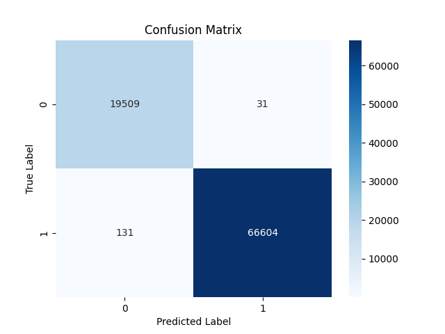

# DDOS Detection Model

## Introduction
This project contains a TensorFlow-based model designed to detect DDoS attacks. The model is built using the Keras and is trained on the CICDDoS2019 dataset.

## Requirements

### Python
Requirements can be installed using `pip`:
```bash
pip install tensorflow keras pandas matplotlib scikit-learn seaborn
```

The requirements.txt is set up for tensorflow-rocm, which is a ROCm-compatible version of TensorFlow, for AMD GPUS.
Therefore, use the above command rather than `pip install -r requirements.txt` if targeting NVIDIA or Intel GPUs.

### Data
The dataset must be downloaded separately; place the csv in the same directory as ddos.py (or update the script to reflect where is resides).
Download the dataset here: https://www.unb.ca/cic/datasets/ddos-2019.html

## Dataset
The dataset used is the CICDDoS2019 dataset, which can be downloaded from [here](https://www.unb.ca/cic/datasets/ddos-2019.html).
The citation for the original paper is as follows:
```
Iman Sharafaldin, Arash Habibi Lashkari, Saqib Hakak, and Ali A. Ghorbani, "Developing Realistic Distributed Denial of Service (DDoS) Attack Dataset and Taxonomy", IEEE 53rd International Carnahan Conference on Security Technology, Chennai, India, 2019.
```

## Usage
When ddos.py is run, the model is trained on the dataset and the results are outputted to the console. The model is then saved to a file called `ddos_detection_model.keras`.
On subsequent runs, if the model exists on the disk, it will be loaded from the file and just evaluated on testing data, rather than being trained again.

*** If you just want to use the model and not train, you can find a pre-trained version in sample_out/ddos_detection_model.keras, simply move it with ddos.py ***

## Results
The model achieves an accuracy of around 99.8% (with very slight variance (~.01) between runs). The confusion matrix of a typical run is shown below:

(Test loss: 0.008, Test accuracy: 0.998):


